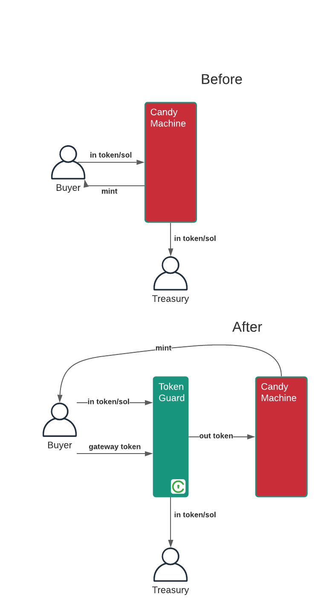

# Token Guard 

A composable [gateway](https://docs.civic.com) program for Solana dApps written in Anchor
and using [Civic Pass](https://www.civic.com).

With TokenGuard, dApp developers can protect access to any dApp that
accepts tokens as payment, such as a Metaplex CandyMachine mint,
without requiring any on-chain smart-contract changes.

NOTE: TokenGuard is currently in beta on devnet only and is unaudited.

## How it works

Let's say you want to set up a CandyMachine that mints NFTs at x Sol each,
and you want to restrict purchase only to holders of a valid [Civic Pass](https://www.civic.com).

1. Set up a TokenGuard that exchanges Sol for a new token T,
created by TokenGuard (the mint authority is a PDA owned by TokenGuard),
if the user has a valid Civic Pass.

2. Set up a CandyMachine that accepts token T instead of Sol

3. In your UI, add a TokenGuard exchange instruction to the mint transaction.

Note: the equivalent pattern applies to other protocols. 



## Coming Soon

[ ] Support for SPL Token (accept SPL instead of Sol)

[ ] Support for membership tokens (non-consumed tokens)

[ ] Mainnet deployment

[ ] Audit

## Usage

Example: CandyMachine using the dummy Civic Pass:
"tgnuXXNMDLK8dy7Xm1TdeGyc95MDym4bvAQCwcW21Bf"

Get the real civic pass address from https://docs.civic.com

## 1. Create a TokenGuard

```shell
$ yarn global add @civic/token-guard
$ token-guard create
TokenGuard created 

ID: FeHQD2mEHScoznRZQHFGTtTZALfPpDLCx8Pg4HyDYVwy
Mint: 6zV7KfgzuNHTEm922juUSFwGJ472Kx6w8J7Gf6kAYuzh
```

## 2. Add a Token Account for the mint

(TODO include this in the TG initialisation step?)

```shell
spl-token -u devnet create-account 6zV7KfgzuNHTEm922juUSFwGJ472Kx6w8J7Gf6kAYuzh
```

## 3. Create the CandyMachine

Check out the [metaplex](https://github.com/metaplex-foundation/metaplex) repository
and follow the steps to install the metaplex CLI.

See [Candy Machine Overview](https://docs.metaplex.com/overviews/candy_machine_overview) for details

```shell
# Find the token account created in step 2
MINT=6zV7KfgzuNHTEm922juUSFwGJ472Kx6w8J7Gf6kAYuzh
TOKEN_ACCOUNT=$(spl-token -u devnet address --token ${MINT} -v --output json | jq '.associatedTokenAddress' | tr -d '"')

# Upload the assets
metaplex upload assets -k ${HOME}/.config/solana/id.json -c devnet
# Create the candy machine instance, referencing the token account
metaplex create_candy_machine -k ${HOME}/.config/solana/id.json -c devnet -t ${MINT} -p 1 -a ${TOKEN_ACCOUNT}
# Set the start date
metaplex update_candy_machine -d now -k ${HOME}/.config/solana/id.json -c devnet
```

### 4. Set up the UI

You need to make two changes to a traditional CandyMachine UI:

#### 4a. Discover a user's Gateway Tokens

Your UI must lookup a wallet's gateway token. For more details on gateway tokens,
see the [Civic Pass documentation](https://docs.civic.com).

Quickstart:

```js
import {findGatewayToken} from "@identity.com/solana-gateway-ts";

const gatekeeperNetwork = new PublicKey("tgnuXXNMDLK8dy7Xm1TdeGyc95MDym4bvAQCwcW21Bf");
const foundToken = await findGatewayToken(connection, wallet.publicKey, gatekeeperNetwork);
```

If you want to integrate Civic's KYC flow into your UI, you can use
Civic's [react component](https://www.npmjs.com/package/@civic/solana-gateway-react).

More details [here](https://docs.civic.com/civic-pass/ui-integration-react-component)

#### 4b. Add the TokenGuard instructions to the mint transaction

```js
import * as TokenGuard from "@civic/token-guard";

const tokenGuard = new PublicKey("<ID from step 1>")
const program = await TokenGuard.fetchProgram(provider)
const instructions = await TokenGuard.exchange(
    connection,
    program,
    tokenGuard,
    payer,
    payer,
    gatekeeperNetwork,
    amount
  );

await program.rpc.mintNft({
  accounts: {
    // ... candymachine accounts
  },
  remainingAccounts: remainingAccounts,
  signers: [mint],
  instructions: [
    ...(tokenGuardInstructions),  // ADD THIS LINE
  //...other candymachine instructions,
  ],
});
```

## Build and deploy the program from scratch

```shell
$ cargo install anchor
$ anchor build
$ anchor deploy
$ anchor idl init
```

## FAQ

#### Q: How does this protect against bots? Couldn't I just execute exchange up-front to mint loads of T and then share them with bot accounts?

Four factors mitigate against that:
- The TokenGuard will mint only x token T per tx
- The TokenGuard will only mint tokens to an ephemeral token account (one with zero lamports, that will be garbage-collected after the transaction)
- The TokenGuard will only mint tokens after a specific go-live date
- (Not yet implemented) The TokenGuard would possibly only mint tokens if the tx also contains a specific instruction (e.g. a candymachine mint instruction)

#### Q: Why not just add the gateway token check inside the smart contract being guarded (e.g. Candy Machine)?

Both are good options. In fact, if you prefer that model, we have forks for
Metaplex [CandyMachine](https://github.com/civicteam/metaplex/pull/5) 
and [Auction contract](https://github.com/civicteam/metaplex/pull/1) that do that.

This option is potentially more flexible, as it can protect any kind of similar on-chain protocol,
without requiring each protocol to change to validate gateway tokens.

#### Q: What about if my protocol accepts an SPL Token instead of Sol?

TokenGuard support for SPL Token is in the roadmap.

#### Q: It looks like TokenGuard is now paying into the Treasury, not my smart contract? What happens if something goes wrong and the buyer has paid the Sol but the smart contract instruction fails?

This is where the beauty of the atomic Solana transaction model comes in.
If the TokenGuard exchange and smart contract instructions are in the same transaction,
and one fails, the whole thing is rolled back and the buyer does not lose Sol.
